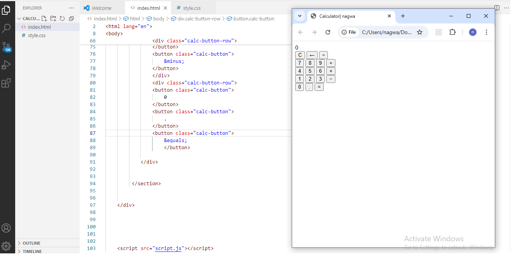
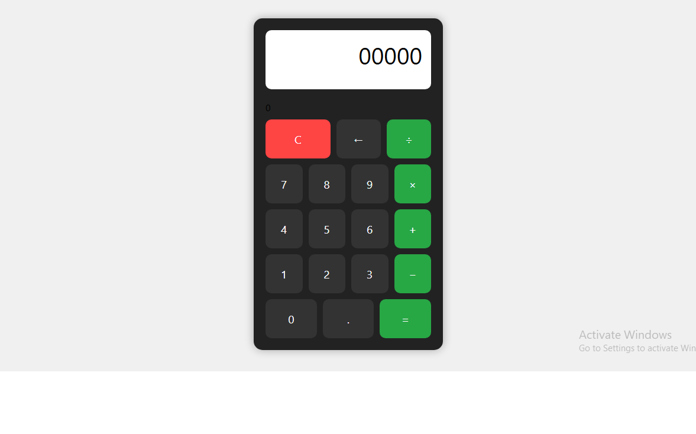

# 🧮 interactive Calculator

A responsive and clean *HTML/CSS/JavaScript calculator* project created with a focus on simplicity, clarity, and usability. Designed and built by *Nagwa*.

---

##  Features

- Basic arithmetic operations: Addition, Subtraction, Multiplication, Division
- Clear (C) and Backspace (←) functionality
- Responsive layout for all screen sizes
- Styled professionally with clean UI

---

## 🛠 Technologies Used

- HTML5
- CSS3 (Flexbox layout)
- JavaScript (Vanilla)

---

## 🚀 Live Demo

🔗 [Click here to try it](https://nagwa-lu.github.io/interactive-calc/

> "Code with clarity, design with purpose."
